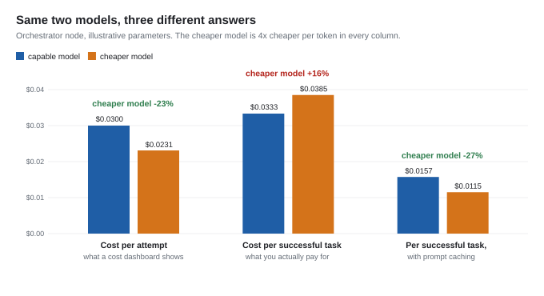

# Decisions in AI Systems

[](https://github.com/MohanVishe/product-case-studies/actions/workflows/tests.yml)

Write-ups on how to choose, configure and evaluate LLMs in production systems. Each one takes a
single decision and works through the reasoning, and where the argument is quantitative it
includes the code to reproduce it.

I build AI agents and the evaluation systems that decide how they're configured.

---

## 1. [Cheaper per token, more expensive per task](cheaper-per-token/article.md)

**Why switching an agent to a cheaper model doesn't reliably cut its bill, why the biggest model isn't the answer either, and how to evaluate every node to find out.**

In an agentic loop you pay per *completed task*, not per token, and the two can move in opposite
directions. A cheaper orchestrator takes more turns, every turn re-sends the whole conversation,
and a lower success rate compounds it: in the worked example, a model 4× cheaper per token comes
out **16% more expensive per successful task**. But the same arithmetic cuts both ways. With
prompt caching it flips to 27% cheaper, and on a leaf node the cheap model is 75% cheaper.



So the answer is an evaluation, and the article lays out which one: five levels (node, trajectory,
turn, multi-turn conversation, reliability over k runs), each measured on accuracy, latency and
cost per completed task, and a loop that decides with gates: quality first, then latency, then
cost. It closes with a small tool-calling agent built as a test subject, evaluated that way on two
local models.

**Measured on a 3B and a 7B model**, in two separate measurements: the agent loop (24 tasks × 5
runs, 120 conversations per model) and a standalone single-call intent router in the same domain
(48 messages × 3 runs). At the orchestrator the 3B would need to be **4.1× cheaper per token**
(95% CI 2.4–7.5×) just to break even per successful task, while passing 20% of tasks against 62.5%
(and 4% against 50% when the same conversation has to work five times running). Re-pricing the
traces with prompt caching doesn't close that gap (4.24×), because it comes from the success rate.
At the router, break-even is **1.13×** (95% CI 1.04–1.24×). Same two models, two kinds of node,
opposite answers.

| | |
|---|---|
| 📄 Article | [`article.md`](cheaper-per-token/article.md) · [PDF](cheaper-per-token/article.pdf) |
| 🧪 Test agent + evaluation | [`experiment/`](cheaper-per-token/experiment/): 8-tool agent, 24 graded multi-turn tasks, a separate single-call router task, traces, results and re-grades |
| 🧮 Cost model | [`cost_model.py`](cheaper-per-token/cost_model.py): reproduces every illustrative number, including the caching case |
| 📊 Figures | [`figures.py`](cheaper-per-token/figures.py): every chart and diagram, from the same data |
| 💬 Short version | [`linkedin-post.md`](cheaper-per-token/linkedin-post.md) |

```bash
uv sync                                                  # Python 3.11+; reportlab and pytest, pinned in uv.lock
uv run python cheaper-per-token/cost_model.py            # the arithmetic, standard library only
uv run python cheaper-per-token/experiment/analyze.py    # recompute results, CIs and re-grades from the saved traces
EVAL_RESULTS=cheaper-per-token/experiment/results-run2 uv run python cheaper-per-token/experiment/analyze.py   # the same for run 2
uv run python cheaper-per-token/figures.py               # redraw the figures
uv run pytest                                            # graders, worked example, and results == fresh recompute
uv run python build_pdfs.py                              # rebuild both PDFs from the markdown
```

**Run 2** (2026-09-26, [`results-run2/`](cheaper-per-token/experiment/results-run2/summary.md)).
A second run with every tool parameter documented, the router at temperature 0 wired in front of
the agent, Ollama's own timings in every span, and graders frozen before the run; same two
models, 24 tasks and 5 seeds. The 3B's success rate rose from 20% to **40.8%** (95% CI 27–55%)
against **68.3%** (52–83%) for the 7B, and the orchestrator break-even fell from 4.10× to
**1.47×** (95% CI 1.01–2.16×). It still exceeds the router's **1.09×** (1.02–1.21×), and the whole
pipeline, router included, breaks even at 1.47× (1.02–2.16×). Better tool docs shrank the
small model's penalty; the ordering of the two nodes held. The ~2 s per-call overhead of run 1
measured 0.03 s with `127.0.0.1`. Run 1's numbers above and in the article are unchanged;
[details and limitations](cheaper-per-token/experiment/README.md#run-2-2026-09-26).

Re-running the experiment itself needs [Ollama](https://ollama.com) and two free local models; the
[experiment README](cheaper-per-token/experiment/README.md) has the commands, the exact setup of the
published run (Ollama version, model digests, quantisation, GPU), and its limitations. No API keys,
no cost.

---

## 2. [Price comes last: gating an AI model change on accuracy](quality-before-cost/case-study.md)

**Setting the bar for a model change on an internal knowledge product, and why cost came last.**

A product decision on a meeting-notes system: accuracy *gates* before cost is considered, rather
than the two being weighed together. Weighing them sounds balanced, but it's how teams talk
themselves into a worse product: the cost figure is precise, the quality figure is noisy, and the
precise number wins the argument regardless of which one matters more.

| | |
|---|---|
| 📄 Case study | [`case-study.md`](quality-before-cost/case-study.md) · [PDF](quality-before-cost/case-study.pdf) |
| 💬 Short version | [`linkedin-post.md`](quality-before-cost/linkedin-post.md) |

---

## The thread between them

Both pieces make one argument from two directions. **The price per token is the easiest number to
read and the least useful one to decide on.** The first shows it quantitatively for agents, with a
method and an experiment; the second shows it as a product decision, where accuracy gates before
cost is considered. In both, the thing that settles the question is an evaluation you ran on your
own system.

---

## About these write-ups

They describe how decisions were made, not the systems behind them: no proprietary architecture, no
client details, no internal specifics. Worked examples use illustrative parameters and say so. The
experiment uses a made-up store, open models and published traces. The code that produces every
number is included, so every figure can be checked, and CI recomputes the results from the traces
on every push.

**Models.** Qwen2.5-Coder 3B (Qwen Research License) and Qwen2.5-Coder 7B (Apache 2.0), by the Qwen
team at Alibaba Cloud, run through Ollama. The store, its customers and orders are made up.

**Licence.** [MIT](LICENSE).

**Contact:** [@MohanVishe](https://github.com/MohanVishe)
