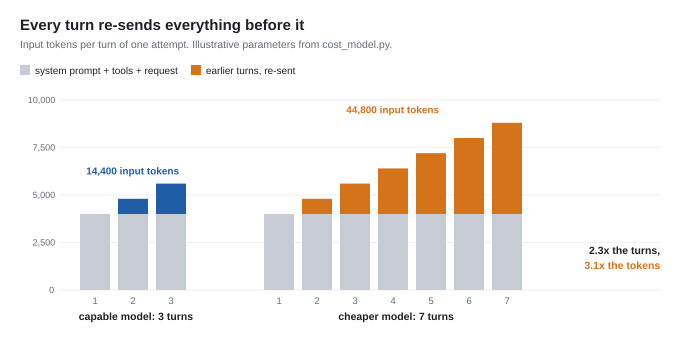
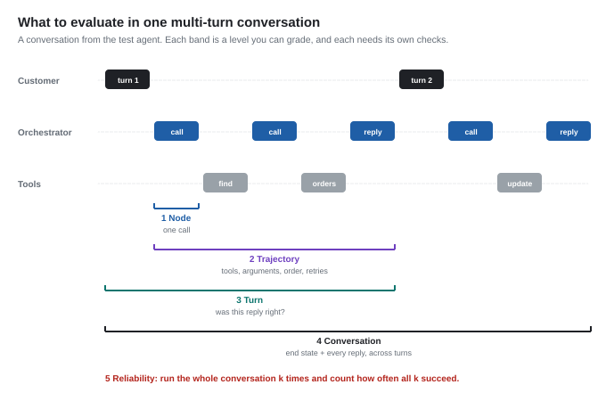
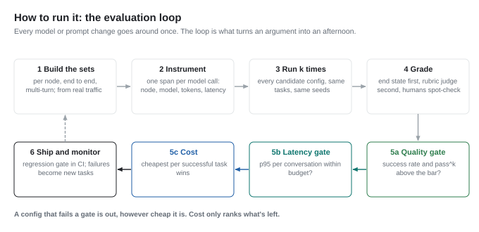
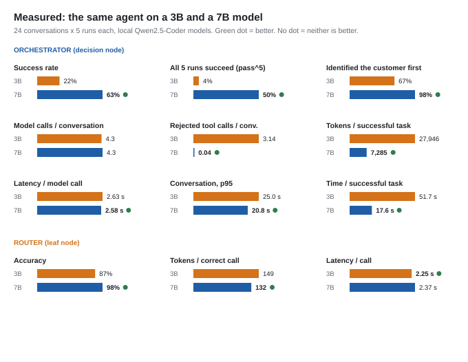
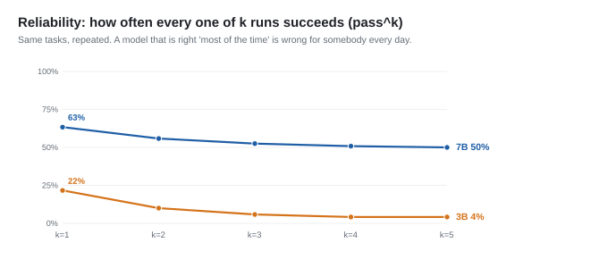
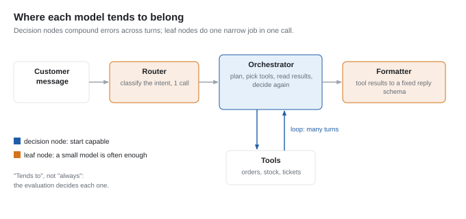

# Cheaper per token, more expensive per task

*Why switching an agent to a cheaper model doesn't reliably cut its bill, why the biggest model isn't the answer either, and how to evaluate every node on accuracy, latency and cost to find out which one you have. Includes a small test agent and real measurements.*

---

## TL;DR

- **Price per token is the wrong unit for an agent.** What you pay for is a *completed task*, and in an agentic loop those two numbers can move in opposite directions.
- **At the node that makes decisions, a cheaper model tends to take more turns, and every turn re-sends the whole conversation.** It also fails more often. In a worked example, a model 4× cheaper per token comes out 16% *more* expensive per successful task.
- **The same arithmetic also cuts the other way.** Turn on prompt caching and the example flips to 27% cheaper. Move the cheap model to a narrow leaf node and it's 75% cheaper. So neither "use the cheap model" nor "use the big model" is a rule.
- **What settles it is an evaluation**: per node, per completed task, over multi-turn conversations, repeated several times, on accuracy, latency and cost. This piece covers what to measure, how to run it, and what it looks like on a small agent you can run yourself.
- **In the experiment**, the 3B model would have to be **4.1× cheaper per token** than the 7B (95% CI 2.4–7.5×) just to break even per successful task at the orchestrator, where it passed 20% of tasks against 62.5%. On a separate leaf-node task in the same domain, a single-call intent router, break-even was **1.13×** (95% CI 1.04–1.24×), so there the price gap passes almost straight through.

The arithmetic is in [`cost_model.py`](cost_model.py), the test agent and its evaluation are in [`experiment/`](experiment/), and every figure is generated by [`figures.py`](figures.py).

---

## The first move everyone makes

When an AI feature's bill gets uncomfortable, the first lever everyone reaches for is the model. Swap the flagship for the smaller sibling, get a fraction of the per-token price, and ship the same feature for less money.

In an agent, the model you're most tempted to swap is the orchestrator: the one that reads the request, plans, chooses a tool, reads the result and decides what to do next. It runs on every turn of every conversation, so it's almost always the biggest line on the bill. On a cost dashboard it's the obvious first target.

It's also the node where downgrading most often backfires.

## What tends to happen when you try it

Suppose you try it on an agent that works with an external tool through a set of tool calls, reading and writing records on the user's behalf. There's sensible pressure to default agents like this to cheaper models, and the obvious experiment is to run the same agent on a smaller model and compare.

Two things can go wrong, and only one of them is the one people watch for.

The expected one is quality. A smaller model can get the tool-output mapping wrong: attach the wrong titles and links to the records it returns, which is the kind of error that looks fine in a demo and breaks trust the first time a user clicks through.

The less expected one is cost. The smaller model doesn't pick the right tool on the first try. It passes arguments that need correcting, calls things it doesn't need, and takes extra rounds to arrive where the capable model goes directly. Each of those rounds is cheap. If there are enough of them, each carrying enough context, the total goes up.

That second effect is the one worth explaining, because it isn't a quirk of one agent. It falls out of how agentic loops are billed. The rest of this piece works it through, first with illustrative numbers and then with a measured experiment.

## Why a cheaper model can cost more

Three multipliers sit between the price per token and the price per task. A cheaper model at the decision-making node tends to make all three worse at once.

### 1. Turn inflation

A capable orchestrator tends to pick the right tool with the right arguments and move on. A weaker one explores: it picks a plausible but wrong tool, passes an argument in the wrong shape, reads an error, re-plans and tries again. Each misstep is at least one extra turn, and often two, since there's the wrong call and then the recovery.

### 2. Context growth, where the damage compounds

Chat-completion APIs are stateless. Every turn re-sends the entire conversation: the system prompt, every tool definition, the original request, and every call and result from earlier turns. So turn five doesn't cost what turn one did. It costs turn one plus everything accumulated since.

If the fixed part is *base* tokens and each turn adds about *inc*, input tokens over *T* turns are:

```
input_tokens(T) = T·base + inc·T(T−1)/2
```

The second term grows with the square of the number of turns. That's why turn inflation hurts more than it looks: in the example below, the cheaper model takes **2.33× as many turns but consumes 3.08× as many tokens**. The extra turns are also the most expensive ones, because they come last, when the context is longest.



### 3. Failure

Not every attempt completes the task. If a run fails and gets retried, the expected cost of one *successful* task is the cost of an attempt divided by the success rate. A weaker orchestrator fails more often, so its cost per attempt gets divided by a smaller number.

## A worked example

Two configurations of the same orchestrator. The cheaper model is 4× cheaper per token, a typical gap between adjacent tiers of one model family. Everything below is produced by [`cost_model.py`](cost_model.py). These are illustrative parameters rather than measurements from any particular system, and they're there to make the mechanism concrete. The model also simplifies on purpose: one blended price for input and output, no charge for writing to a cache, and failed attempts detected and retried at no extra cost. Each is a parameter or a line in the file, so you can change it; the mechanism is the point, not the figures.

| | Capable model | Cheaper model |
|---|---:|---:|
| Price per 1M tokens | $2.00 | $0.50 |
| Turns per attempt | 3 | 7 |
| Tokens per attempt | 15,000 | 46,200 |
| **Cost per attempt** | **$0.0300** | **$0.0231** |
| Success rate | 90% | 60% |
| **Cost per successful task** | **$0.0333** | **$0.0385** |

Look at the two bold rows together, because the difference between them is the trap.

**Per attempt, the cheaper model is cheaper**: $0.023 against $0.030, a saving of about a quarter. That's what a cost dashboard shows you, because it counts calls and runs rather than outcomes. The swap looks like it worked.

**Per successful task, the cheaper model is 16% more expensive.** And that number leaves out the part of the bill that isn't tokens: the wrong links a user acted on, the support ticket that followed, and the engineer who spent an afternoon working out why.

### The break-even rule

The example generalizes into one inequality. A cheaper model is actually cheaper per successful task only if:

```
price ratio  >  token ratio  ×  success ratio
```

where *price ratio* is how many times cheaper it is per token, *token ratio* is how many times more (billed) tokens it burns per attempt, and *success ratio* is the capable model's success rate divided by the cheaper one's.

Here the cheaper model is 4× cheaper, but it needs to be **4.62× cheaper** to break even (3.08 × 1.5). It falls short, so it loses.

The rule matters because it tells you exactly what you need to know before deciding: all three ratios. You can read one of them, the price ratio, off a pricing page. The other two only come from running the models on your task.

## The same arithmetic, pointing the other way

It would be easy to stop there with "cheap models cost more in agents". That's wrong too, and the same model shows why, twice.

### Prompt caching can flip the answer

Most model APIs can now cache a prompt prefix they've already seen and bill it at a steep discount; on some providers a cache read costs a tenth of the normal input price. In an agent loop, almost everything a turn sends was sent the turn before, so caching goes straight at multiplier 2. Run the same example with re-sent context billed at 10%:

| | Capable model | Cheaper model |
|---|---:|---:|
| Tokens per attempt | 15,000 | 46,200 |
| Billed tokens, after caching | 7,080 | 13,800 |
| **Cost per successful task** | **$0.0157** | **$0.0115** |

**Now the cheaper model is 27% cheaper per successful task.** The break-even ratio drops from 4.62× to 2.92×, and a 4× price gap clears it.


Notice what didn't change: it still fails 40% of tasks against the capable model's 10%, and it still makes seven round trips to the capable model's three. Caching removed cost as the reason to reject it. It did nothing for quality or latency, which is why cost can't be the only thing you measure. (In the measured experiment below, caching doesn't flip the answer at all, because there the gap comes mostly from the success rate rather than from context growth.)

### Leaf nodes pass the saving straight through

Take a well-scoped leaf node: one call, a narrow job, a predictable output. Classifying a request into one of five intents, reformatting a tool result into a fixed schema, pulling three fields out of a known document type. There's no loop to inflate and no context to accumulate, and a smaller model often does the job about as reliably:

| | Capable model | Cheaper model |
|---|---:|---:|
| Turns per attempt | 1 | 1 |
| Success rate | 98% | 97% |
| **Cost per successful task** | **$0.0086** | **$0.0022** |

**Same cheaper model, 75% cheaper.** Nothing multiplies the price gap away. Routing narrow calls to smaller models is well established: FrugalGPT (Chen, Zaharia & Zou, 2023) showed that cascading queries across models of different cost can cut spend substantially while holding accuracy, and RouteLLM (Ong et al., 2024) trains routers that send each query to a strong or weak model and reports cost reductions of over 2× without losing quality.

So the accurate claim is narrower than "cheap models cost more", and more useful:

> **A cheaper model does not automatically reduce the cost of an agentic system, and a more capable one doesn't automatically improve it. At the node that makes decisions, a cheaper model often *increases* total cost; with caching it may not; at well-scoped leaf nodes it usually cuts cost substantially. Which case you're in depends on turns, success rate, caching and latency, and you only learn those by measuring.**

## Neither the cheap model nor the big one

"Just use the flagship everywhere" isn't a safe default either. A large model on a leaf node pays four times the price for the same answer. It's slower per call, which matters for anything a user waits on. And capability doesn't transfer evenly: a larger model can over-plan simple requests, call tools it doesn't need, or write long replies where a short one was wanted, which is turn inflation and output tokens coming from the other direction.

Both instincts are guesses about three numbers you haven't measured. The way out is an evaluation, but it has to be the right kind. A benchmark leaderboard measures someone else's tasks. A single run of a single prompt measures one sample of a random process. A cost dashboard measures calls, not outcomes. What you need measures *your* agent, per node and per completed task, on accuracy, latency and cost at once.

## What to evaluate

An agent conversation can be graded at five levels, and each one answers a different question. Grading only the final answer misses why things went wrong; grading only individual calls misses the cost that one node pushes onto another.



| Level | Accuracy | Latency | Cost |
|---|---|---|---|
| **1 Node**: one model call | Is this call's output right for its job? The intent label, the extracted fields, a valid tool name with valid arguments | Per-call latency; time to first token if it streams | Tokens per call |
| **2 Trajectory**: the calls and tool uses within a turn | Right tools, valid arguments, no redundant calls, policy steps in the right order, recovery after a tool error | Number of round trips | Turns × context size |
| **3 Turn**: one user message to one reply | Is the reply correct and grounded in what the tools returned? | Time from message to reply | Tokens per turn |
| **4 Conversation**: the whole multi-turn exchange | Is the end state right, and was every reply right? Were follow-ups like "change *its* address" resolved from earlier context? | Total time; p50 and p95 across conversations | Tokens per conversation; **per successful conversation** |
| **5 Reliability**: the same conversation, k times | Do all k runs succeed (pass^k)? | Spread between runs; the tail | Cost per success including retries |

A few of these deserve more than a table cell.

### Accuracy: grade the end state, not the wording

For anything that changes the world (cancels an order, updates a record, files a ticket), the most reliable check is the state the system ends up in. τ-bench (Yao et al., 2024) grades agents by comparing the database at the end of a conversation with the expected one, and that's the approach the test agent below uses. It's deterministic, it's cheap, and it doesn't care how the agent phrased things.

Free text needs more. Check required facts deterministically where you can (the order number, the date, the price), then use an LLM judge with an explicit rubric for the rest: tone, completeness, whether it explained a refusal. Calibrate the judge against a sample of human labels before trusting it, because judges have known biases toward longer answers, toward the first option shown, and toward their own model family (Zheng et al., 2023). Then spot-check by hand, every time.

### Trajectory: how it got there

Pass/fail tells you *that* something broke. The trajectory tells you *why*, and it's where cost problems show up first. Useful trajectory metrics:

- **Tool selection accuracy**: did it call the tool a competent operator would have?
- **Argument validity**: how many calls were rejected by the tool's own validation?
- **Redundant calls**: lookups repeated, or tools called whose results were never used.
- **Policy adherence**: did required steps happen, in order? For example, identifying the customer before touching their orders.
- **Recovery rate**: after a tool error, did it fix the call or give up?

Most of these are diagnostics rather than gates. A trajectory can be untidy and still reach the right end state. They're what you read when a cost per success moves and you need to know which node moved it.

### Multi-turn: the conversation is the unit

Single-shot tests miss most of what makes agents hard. In a real conversation the user refers back ("change *its* address"), answers a clarifying question, changes their mind ("actually, cancel it instead"), and the context grows with every exchange. There are three ways to test that, in rising order of realism and cost:

- **Scripted follow-ups**: fixed user messages fed after each agent reply. Deterministic and cheap. The test agent below uses these.
- **Simulated users**: a second model plays the customer with a hidden goal, as in τ-bench. More realistic, and it adds noise and cost of its own.
- **Replayed conversations**: real (anonymized) conversations from production, with the end state graded.

### Reliability: one run is an anecdote

Language models sample. Run the same conversation twice and you can get two different trajectories, so a single pass tells you what *can* happen, not what usually does. Run each case k times and report two numbers:

- **pass@k**: at least one of k runs succeeded. That's the right measure when a human picks the best of several attempts.
- **pass^k**: *all* k runs succeeded. That's the right measure for an agent acting on users' behalf, because every user gets one run.

They diverge fast. An agent that succeeds 90% of the time, independently, succeeds on all of five runs only 59% of the time (0.9⁵). τ-bench found that even the strongest function-calling agents of the time succeeded on fewer than half its tasks, and that in its retail domain pass^8 fell below 25%.

### Latency: per task, and the tail

Latency behaves exactly like cost. A smaller model generates tokens faster, but seven round trips to a fast model can take longer than three to a slow one, and every extra round trip also pays the tool's own latency again. Measure time per conversation rather than per call, and report the p95 as well as the median. The median is what your dashboard shows; the p95 is what your unhappiest users experience, and agent latency has a long tail because some conversations loop.

### Cost: per successful task, billed the way you're billed

Count every token, including the ones spent on failures, divide by successes, and price it with your provider's actual rules: input and output prices, cached versus uncached input. Report the break-even ratio alongside it. "The small model must be at least 2.9× cheaper per token to win here" survives a price change; a dollar figure doesn't.

## How to run the evaluation



**1. Build the evaluation sets.** One per node that calls a model, plus one end to end, plus multi-turn conversations. Draw them from real traffic where you can, and deliberately include the awkward cases: policy refusals, ambiguous references, requests that need three lookups, users who change their minds. Twenty to fifty cases per node is enough to start. Version the set, so results stay comparable over time.

**2. Instrument every model call as a named node.** Record the node, the model, input, output and cached tokens, latency, and the outcome, for every call. The OpenTelemetry semantic conventions for generative AI define standard attributes for this (`gen_ai.usage.input_tokens` and friends), so any tracing backend can read it. Without per-node attribution you get one blended cost line, and one node's turn inflation disappears inside it.

**3. Run every candidate configuration k times.** Same tasks, same seeds, same sampling settings as production. Change one node at a time, so a difference has one cause. Start from the capable configuration as the baseline, then try cheaper models node by node. Going the other way, starting cheap and upgrading whatever visibly breaks, only catches failures that are loud, and turn inflation is quiet.

**4. Grade.** End state and required facts deterministically first, a calibrated judge for what's left, humans on a sample.

**5. Decide with gates, not a weighted score.** First, quality: success rate and pass^k must clear a bar you set before looking at the results. Second, latency: the p95 per conversation must fit the budget. Only then does cost per successful task rank whatever survived. Plotting the candidates as accuracy against cost, a Pareto frontier as Kapoor et al. (2024) recommend for agent evaluations, makes the trade-off visible at a glance. A weighted score sounds balanced, but it lets a precise cost number outvote a noisy quality number, and that's how teams argue themselves into a worse product. (The [companion case study](../quality-before-cost/case-study.md) is about exactly that decision.)

**6. Ship behind a regression gate, and keep measuring.** The evaluation runs in CI whenever a prompt, tool, model version or price changes, and a regression blocks the release. In production, sample live conversations for online grading and watch cost and latency per node. Every production failure becomes a new case in step 1.

None of this is expensive. The evaluation below, 240 agent conversations and 288 router calls, ran on one consumer GPU in 56 minutes, at no cost, and most of those minutes were a fixed per-request overhead in the harness (covered below).

## An experiment you can run

To make this concrete, I built a small agent as a test subject, evaluated it the way this piece describes, and published the whole thing in [`experiment/`](experiment/). It needs Python and [Ollama](https://ollama.com) and nothing else: no API keys, no cost.

**The agent** is a customer-support agent for a made-up online homeware store. It has eight tools (find a customer, list and read orders, search products, cancel, change address, open a return, escalate to a human) and four policy rules: identify the customer first, only touch their own orders, only change orders that haven't shipped (escalate otherwise), and only accept returns within 30 days. The store lives in memory and resets for every conversation.

**The evaluation set** is 24 conversations in four categories: lookups, multi-hop questions ("where is my order?" when the agent has to find which one), write actions including the right refusals, and multi-turn conversations with scripted follow-ups. Each is graded on the store's end state and on the facts the reply must contain. A second, separate task measures a leaf node: a single-call intent router, with its own 48 labelled messages. The agent doesn't call the router. It's a second measurement on the same two models, in the same domain.

**The models** are two sizes of one open model family, Qwen2.5-Coder 3B and 7B, run locally. Each orchestrator conversation ran 5 times and each router message 3 times, at temperature 0.7. Neither model used the structured tool-call field, so the agent parses tool calls written as text, the same way for both; and only one of the 13 tool parameters has a description, which turned out to matter (see the limitations). Local models have no price, so cost is reported as tokens per successful task (output tokens weighted 4×, a typical price ratio) and as the break-even price ratio: how much cheaper per token the small model would have to be to cost the same per success.

### What came out

Each model ran 120 conversations (24 tasks × 5) and 144 router calls (48 messages × 3). Every number below is recomputed from the saved traces by [`analyze.py`](experiment/analyze.py), with 95% bootstrap intervals over tasks. The graders were revised after the run to fix errors found on review, in both directions; the 9 grades that changed are listed in [`regrade.md`](experiment/results/regrade.md).



**On the metrics a dashboard shows, the two models look identical.** Both averaged 4.3 model calls
per conversation, and both took about 11 seconds of model time per conversation. If you were
watching call counts, the downgrade would look free. (The equal call counts are real. The equal time
says less than it seems: about 2 seconds of every call in this harness is fixed per-request
overhead, and the 3B decodes about twice as fast as the 7B.)

**On outcomes they aren't close.**

| Orchestrator | 3B | 7B |
|---|---:|---:|
| Success rate (95% CI) | 20% (10–32%) | 62.5% (45–79%) |
| All 5 runs succeed (pass^5) | 4% | 50% |
| Lookups / multi-hop / writes / multi-turn | 57% / 0% / 17% / 7% | 87% / 47% / 73% / 43% |
| Rejected tool calls per conversation | 3.14 | 0.04 |
| Gave up without answering (10-call cap) | 18% of conversations | 0% |
| Identified the customer before touching orders | 67% | 98% |
| Tokens per conversation | 6,055 | 4,614 |
| **Tokens per successful task** | **30,274** | **7,382** |
| Time per conversation, p50 / p95 | 7.4 s / 25.0 s | 10.1 s / 20.8 s |
| **Time per successful task** | **56.0 s** | **17.8 s** |

**The break-even price ratio at the orchestrator is 4.1×** (95% CI 2.4–7.5×). The 3B would have to
be about four times cheaper per token than the 7B before the swap paid for itself. With 24 tasks the
interval is wide, but even its low end is about twice the router's (below). And that's only the
cost argument. The quality gate settles it first: 20% against 62.5%, and 4% against 50% when the
same conversation has to work five times out of five.

The mechanism was partly the one the arithmetic predicts and partly not, which is the best argument
for measuring rather than reasoning. **Turn inflation did show up**, in tool calls rather than model
calls: 6.9 tool calls per conversation against 3.0, with 3.14 of them rejected by the tools'
own validation against 0.04. Every rejection puts an error into the context that the next call
re-sends, and the measured context confirms it: both models start at 764 input tokens on the first
call of a conversation, and by the eighth call the 3B is carrying 2,142 tokens against the 7B's
1,424. (Only conversations that got that far count there: 21 of the 3B's, every one of them a run
that hit the loop cap, and 9 of the 7B's.)

**What the arithmetic didn't predict was how the small model fails.** It often doesn't loop; it
quits. It answered from a rejected tool call, invented a SKU, or replied "I couldn't find your
order" after one failed lookup. In 18% of conversations it did loop until the 10-call cap and never
answered at all. That's why its median conversation is *faster* than the 7B's (7.4 s against 10.1 s)
while its p95 is worse (25.0 s against 20.8 s) and its time per successful task is three times
worse. A median latency dashboard would have shown the downgrade as an improvement.



The reliability curve is the number I'd put in front of anyone deciding this. One run in five of
the 3B's conversations succeeds; ask for the same conversation to work five times in a row and it
holds up 4% of the time (one task of 24). The 7B is not brilliant either, at 50% (12 of 24). It's a
reminder of how much distance there is between "it worked when I tried it" and "it works".

### The same cheap model, at a leaf node

| Intent router | 3B | 7B |
|---|---:|---:|
| Accuracy, 48 messages × 3 runs (95% CI) | 87% (80–93%) | 98% (94–100%) |
| Input tokens per call | 118 | 118 |
| Tokens per correct call | 149 | 132 |
| Latency per call (about 2 s of it fixed overhead) | 2.25 s | 2.37 s |
| **Break-even price ratio** (95% CI) | **1.13×** (1.04–1.24×) | |

One call, a fixed output, no loop, no accumulating context. Both models send the same 118 tokens,
and the break-even ratio collapses from 4.1× to **1.13×**: almost the whole price gap passes
through. On cost, the 3B wins here and it isn't close.

Whether you'd ship it is a quality question, not a cost one, and it depends on what happens after a
misroute. 87% means about one message in eight goes down the wrong path. Behind a fallback that
can recover, that may be fine. If the route triggers an irreversible action, it isn't.

**Two kinds of node, the same two models, opposite answers.** These are two separate measurements,
an agent loop and a standalone classifier in the same domain, not one pipeline; wiring the router
into the agent is the next run. The contrast between them is the whole argument of this piece,
measured rather than asserted.

### Limitations, and what's next

- Two models from one family, at one size gap, on one small domain. The method transfers; the
  numbers don't. The coder variants were used because they were already on the machine.
- Tool calls were parsed from text, because neither model used the structured tool-call field, and
  only one of the 13 tool parameters has a description. 117 of the 3B's 377 rejected calls copied a
  parameter's schema into the argument. So the gap is measured under this tool interface, and part
  of it is the small model's sensitivity to that interface.
- Token counts are uncached. Re-pricing the saved traces with each call's re-sent prefix billed at
  10% gives a break-even of 4.24× (95% CI 2.6–7.6×), slightly *wider* than uncached. Caching flips
  the worked example above, but not the measured result: here the gap comes from the success rate,
  not from context growth.
- Latency is local, on one consumer GPU. About 2 s of every call is a fixed per-request overhead in
  the harness (the fastest call in the run, with 3 output tokens, took 2.06 s), and the 3B decodes
  about twice as fast as the 7B (roughly 163 against 76 tokens per second), so the near-identical
  per-call latency is an artifact. Time per conversation and per success still compare fairly,
  because both models pay the same overhead per call; they track call count and success rate.
- The graders check end state and required facts, not tone, and they were revised after the run to
  fix errors found on review; every changed grade is published. The multi-turn users are scripted,
  which is easier than real ones.
- 24 tasks is a starting evaluation set, not a benchmark, which is why every headline number carries
  a confidence interval. The point is that a set this small, running in under an hour at no cost,
  already answered the question.
- **Next:** describe every tool parameter, add a model pair with native tool calling, run the router
  at temperature 0 and wire it into the agent, and log Ollama's own timings against `127.0.0.1`. The
  [experiment README](experiment/README.md#next) has the full list.

## The architecture that tends to fall out

Measure honestly and a pattern tends to appear, one that runs against the cost-cutting instinct:

- **Put capable models where decisions are made**: the orchestrator, the planner, the router that picks a whole path. Errors there compound through every turn that follows.
- **Put cheap models where the work is well specified**: classification, extraction, formatting, summarizing a known structure. There the price gap passes through intact.



The instinct says the orchestrator should be downgraded first, because it's the biggest line on the bill. The arithmetic says it's usually the last place to downgrade, because it's the one node whose mistakes multiply. But "usually" is doing real work in that sentence. Caching, a better prompt, a newer small model or a simpler tool set can each change the answer, and the only way to know is to run the evaluation again.

---

## Closing

"Which model is cheapest?" is the wrong question for an agent, and "which model is best?" is the wrong question too. The useful one is *which model does this node's job well enough, fast enough, for the least money per completed task?* A pricing page can't answer that, and neither can a leaderboard. The only thing that can is an evaluation of your own system: per node, per task, over whole conversations, repeated until the numbers stop moving.

The price per token is the one number in this whole calculation you can read off a web page, and it's the one that matters least.

---

*I build AI agents and the evaluation systems that decide how they're configured. Reproduce the numbers with [`cost_model.py`](cost_model.py) and the experiment with [`experiment/`](experiment/).*

## References

- Lingjiao Chen, Matei Zaharia, James Zou. *FrugalGPT: How to Use Large Language Models While Reducing Cost and Improving Performance.* arXiv:2305.05176, 2023.
- Isaac Ong et al. *RouteLLM: Learning to Route LLMs with Preference Data.* arXiv:2406.18665, 2024.
- Shunyu Yao, Noah Shinn, Pedram Razavi, Karthik Narasimhan. *τ-bench: A Benchmark for Tool-Agent-User Interaction in Real-World Domains.* arXiv:2406.12045, 2024.
- Sayash Kapoor, Benedikt Stroebl, Zachary S. Siegel, Nitya Nadgir, Arvind Narayanan. *AI Agents That Matter.* arXiv:2407.01502, 2024. On reporting cost alongside accuracy, as a Pareto frontier.
- Lianmin Zheng et al. *Judging LLM-as-a-Judge with MT-Bench and Chatbot Arena.* arXiv:2306.05685, 2023.
- OpenTelemetry. *Semantic conventions for generative AI systems.* opentelemetry.io/docs/specs/semconv/gen-ai/
